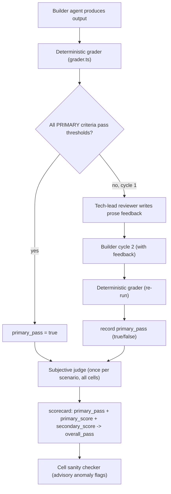

# Context Graph Benchmarking — Grading & Scoring

A shareable reference for how the Context Graph benchmark scored agent runs. It covers the **one deterministic grader** and the **three LLM components** (only one of which actually contributes to scores), the acceptance-criteria model, and the design principles behind the prompts.

> **Status in this repo — read first.** These five documents are *imported design reference*, carried over from
> [APIFlow-Bench-benchmarks#12](https://github.com/postman-eng/APIFlow-Bench-benchmarks/pull/12). They describe the grading model
> as implemented in the `context-graph-poc` prototype, and the file paths cited below refer to *that* codebase — not to this one.
> Nothing here executes.
>
> How the four components map onto this repo today:
>
> | # | Component | This repo |
> |---|---|---|
> | 1 | Deterministic grader | ✅ `src/core/scorers/deterministic.ts` (plus `exact.ts`, `toolTrace.ts`) |
> | 2 | Subjective judge | ✅ `src/core/scorers/judge.ts`, rubrics in `src/evals/agent-benchmark.ts` |
> | 3 | Tech-lead reviewer | ❌ not implemented — no second builder cycle exists here |
> | 4 | Cell sanity checker | ❌ not implemented |
>
> The scorecard math below (`primary_pass` / `primary_score` / `secondary_score`) is also prototype-specific. This repo's
> runner averages every scorer's normalized score into `aggregateScore` and passes at ≥ 0.5 — see `src/core/runner.ts`.
> Treat §"Design principles to carry into a fresh setup" as the durable part.

> Source of truth: `context-graph-poc/runner/src/grader.ts`, `runner/src/run-common.ts`, `scripts/subjective-judge.ts`, `scripts/cell-sanity-check.ts`. These docs transcribe the prompts verbatim (placeholders shown as `${...}`).

## The one rule that matters most

**Anything measurable is scored deterministically. LLMs only score genuinely subjective quality.** Precision, recall, F1, JSON validity, file existence, and regex/structural checks are computed by code — never by a model. This is what keeps results reproducible and defensible.

## The four components

| # | Component | LLM? | Contributes to score? | When it runs | File |
|---|---|:---:|:---:|---|---|
| 1 | Deterministic grader | No | **Yes (primary)** | Every cycle, per cell | `04-deterministic-grader.md` |
| 2 | Subjective judge | Yes | **Yes (secondary)** | Once per scenario, all cells together | `01-subjective-judge.md` |
| 3 | Tech-lead reviewer | Yes | No (feedback only) | When a primary criterion fails cycle 1 | `02-tech-lead-reviewer.md` |
| 4 | Cell sanity checker | Yes | No (audit/advisory) | Once per comparison, after grading | `03-cell-sanity-check.md` |

## How a cell is scored (flow)



## Acceptance-criteria model

Every scenario ships a list of acceptance criteria. Each criterion declares how it's scored and whether it gates the cell:

```jsonc
{
  "id": "recall_meaningful",
  "requirement": "At least 50% of the truly impacted services are identified.",
  "primary": true,                 // if a PRIMARY criterion fails, the cell fails
  "scoreFrom": "deterministic",    // "deterministic" -> grader; "subjective" -> judge
  "passingThreshold": 0.5          // only for deterministic; raw-value threshold that means "passed"
}
```

- `scoreFrom: "deterministic"` criteria MUST have a matching entry in the scenario's `gradingChecks[]` (same `id`).
- `scoreFrom: "subjective"` criteria are scored by the judge; no grading check needed.
- Grading is **uniform across variants** — the same criteria apply to every arm (no per-variant filtering).

## The scorecard

```
primary_pass    : bool   — ALL primary criteria hit their thresholds
primary_score   : 0-10   — composite of primary deterministic scores
secondary_score : 0-10   — mean of the subjective judge's scores
overall_pass    : bool   — primary_pass AND secondary_score >= 6
```

**Reporting rule:** for set-answer tasks (blast radius, discovery, testing-sync) lead with **recall**, not the blended `primary_score` — the blend includes a free point for "valid JSON" and can flatter a low-recall run.

## Models & settings

- Model for all three LLM components: `claude-sonnet-4-5` (grading is model-light; runs used Sonnet).
- All use structured output (`generateObject` + Zod schema) with a `$parameter` unwrap + `jsonrepair` recovery path for Anthropic's occasional malformed tool-args.
- The judge and sanity checker each make **one** call per scenario/comparison that sees **all cells at once** — this is deliberate (consistent scoring, no cross-call drift).

## Design principles to carry into a fresh setup

1. **Deterministic-first.** Never let a model score something you can compute.
2. **Score subjective criteria relatively, once, across all cells** — eliminates cross-call variance.
3. **Anonymize + shuffle** cells before judging so the model can't favor a variant.
4. **Explicit anti-curve rule** — "if all did poorly, score all low"; don't spread scores to look discriminating.
5. **Separate feedback from scoring** — the reviewer improves the next attempt but never influences the number.
6. **Audit the graders too** — a model-based sanity pass catches grader false-negatives and agent claim-inflation, but stays advisory.
